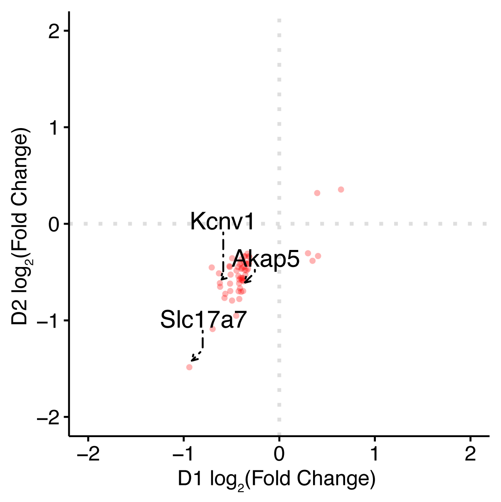

Epigenetic function during heroin self-administration controls future relapse-like behaviors in a cell type-specific manner 
==========================

This repository contains analysis code for the HDAC5 ~ heroin gene expression project carried out by researchers at the [Cowan Lab, MUSC](https://medicine.musc.edu/departments/neuroscience/research/cowan)

## Cite this

If you use anything in this repository please cite the following publication:

URL: https://www.pnas.org/doi/abs/10.1073/pnas.2210953120

## Files

| directory | contents | code |
| --------- | -------- | -------- |
| [`input`](input/) | Input data of the initial processing and quality check. | 01_Oligo_Analysis_Ethan.R \ 02_Create_InputData.R|
| [`d1_dge`](d1_dge/) | Output of the Differential expression analysis for D1 MSN. | 03_Dge_D1.R \ 06_GO_D1.R|
| [`d2_dge`](d2_dge/) | Output data of the correlative analysis for D2 MSN. | 04_Dge_D2.R \ 07_GO_D2.R|
| [`Combined_Data`](Combined_Data/) | Output data for D1-D2 combined data. | 08_Combination.R |
